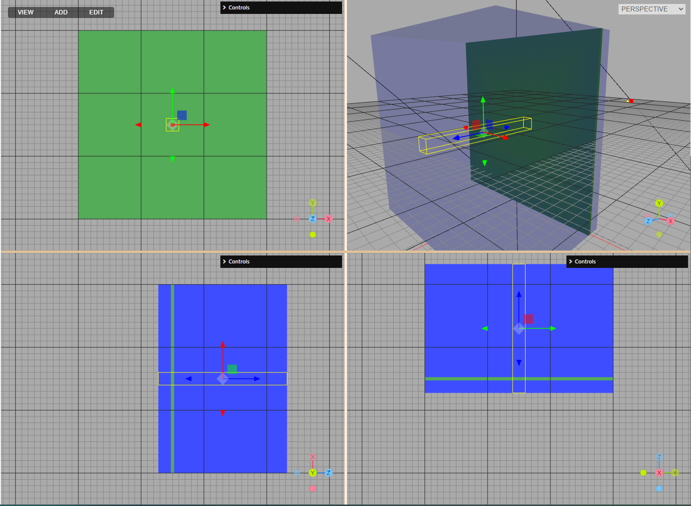

# Guidelines for contributing

This directory contains:
 - common [resources](https://github.com/APTG/2022_DCPT_LET/tree/main/data) like beam model, treatment plan DICOM files, phase space files etc
 - input files and results obtained using various MC codes: [SHIELD-HIT12A](https://github.com/APTG/2022_DCPT_LET/tree/main/data/sh12a), [TOPAS](https://github.com/APTG/2022_DCPT_LET/tree/main/data/topas)

## Coordindate system

In this project we assume that irrespectively of the gantry and couch angle, then beam is always directed along the positive Z axis. When necessary the phantom volume needs to be rotated to match this convention.

In order to compare the results with TPS or other sources we can transform the MC results to desired coordinate system.

## Scoring volumes

We suggest to adhere to the list of scoring quantities and scoring volumes described below. This will allow to compare the results obtained using different MC codes.

### Target volume

This volume represent the detector positioned in the PMMA holder. Center of the volume is equivalent to the isocenter position. The volume is large enough to cover the whole detector.

`[-2.5, 2.5] x [-2.5, 2.5] x [-0.1, 0.1] cm³`

Lateral extension of all the fields in treament plans is twice the size of the target volume. Plans cover the PTV of 10 x 10 x 10 cm³.

This is the target volume for plan2:

### Narrow depth profile

To score depth profile of basic quantities we suggest to use a narrow volume of 2 x 2 x 20.5 cm³. The volume is centered at the isocenter position. 

`[-1.0, 1.0] x [-1.0, 1.0] x [-10.25, 10.25] cm³`

The volume should be divided into 205 bins of 1 mm thickness along the Z axis.

The span of the volume along Z axis: 20.5 cm covers the 20 cm of the solid water phantom and 0.5 cm of the detector plate.

This is the narrow profile for plan2:

### Lateral map

Two dimensional map is useful to check the spot positions at the isocenter plane. We suggest to use a thin slab covering whole solid water phantom in lateral direction and 5 mm in depth.

`[-15.0, 15.0] x [-15.0, 15.0] x [-0.25, 0.25] cm³`

This is the lateral map for plan2:

### Longitudal map

Two dimensional map useful to check the beam divergence. We suggest to use a thin 2cm slab positioned in XZ plane:

`[-15.0, 15.0] x [-1.0, 1.0] x [-10.25, 10.25] cm³`

This is the longitudal map for plan2:

## Scoring quantities

### Target volume

- dose deposited by all particles
- fluence of primary protons
- all types of averaged linear energy transfer (LET)
- other derived quantities (mean kinetic energy, effective Q etc)

### Narrow depth profile

- dose deposited by all particles
- fluence of primary protons
- basic types of averaged LET (dose weighted, fluence weighted)

### Lateral and longitudal map

- dose deposited by all particles
- fluence of primary protons
