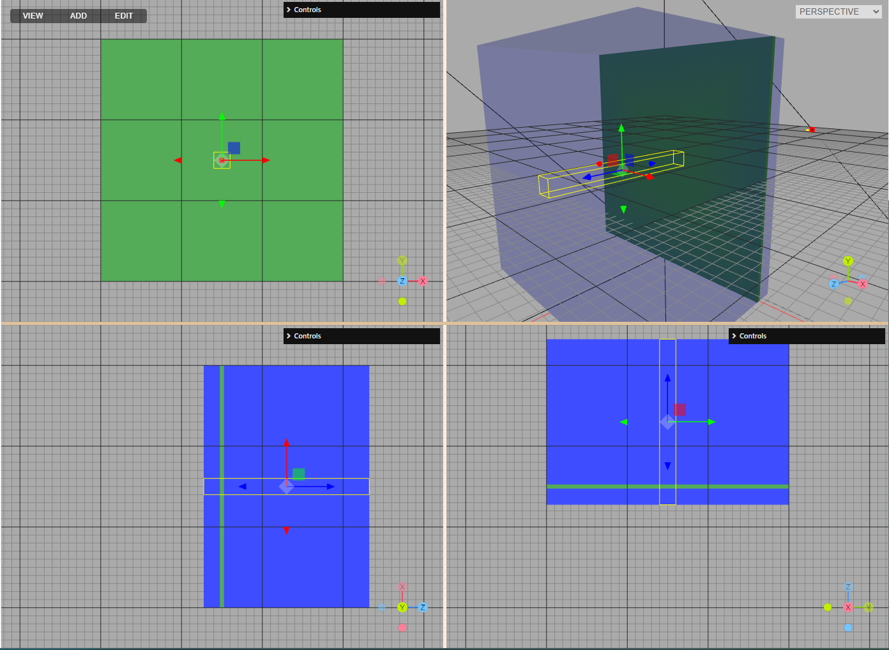

## Scoring volumes
We suggest to adhere to the list of scoring quantities and scoring volumes described below. This will allow to compare the results obtained using different MC codes.

-
### Target volume
This volume represent the detector positioned in the PMMA holder. Center of the volume is equivalent to the isocenter position. The volume is large enough to cover the whole detector.

`[-2.5, 2.5] x [-2.5, 2.5] x [-0.1, 0.1] cm³`

Lateral extension of all the fields in treatment plans is twice the size of the target volume. Plans cover the PTV of 10 x 10 x 10 cm³.

The yellow box shows the **target volume** for plan2:

### Depth profile
To score depth profile of basic quantities we suggest to use a narrow volume of 2 x 2 x 20.5 cm³. The volume is centered at the isocenter position.

`[-1.0, 1.0] x [-1.0, 1.0] x [-10.25, 10.25] cm³`

The volume should be divided into 205 bins of 1 mm thickness along the Z axis.

The span of the volume along Z axis: 20.5 cm covers the 20 cm of the solid water phantom and 0.5 cm of the detector plate.

The yellow box shows the **narrow profile** for plan2:

### Lateral map
Two dimensional map is useful to check the spot positions at the isocenter plane. We suggest to use a thin slab covering whole solid water phantom in lateral direction and 5 mm in depth.

`[-15.0, 15.0] x [-15.0, 15.0] x [-0.25, 0.25] cm³`

The yellow box shows the **lateral map** for plan2:

### Longitudinal map
Two-dimensional map useful to check the beam divergence. We suggest to use a 2 cm thick scoring slab positioned in XZ plane:

`[-15.0, 15.0] x [-1.0, 1.0] x [-10.25, 10.25] cm³`

The yellow box shows the **longitudinal map** for plan2:

## Scoring quantities
### Target volume
- any available type of averaged linear energy transfer (LET)
- other derived quantities (mean kinetic energy, effective Q, etc.)

### Narrow depth profile
- dose deposited by all particles (dose-to-water and dose-to-medium)
- fluence of primary protons
- basic types of averaged LET (dose weighted, fluence weighted)

As for the types of LET we suggest to use:
 - a) dose- and b) track- averaging
 - scoring including following groups of particles: a) primaries, b) all protons (primary and secondary), c) all charged ions
 - a) in water at density of 1.000 g/cm³, b) in medium at its actual density

See Kalholm, Fredrik, et al. "A systematic review on the usage of averaged LET in radiation biology for particle therapy." Radiotherapy and Oncology 161 (2021): 211-221. for more details on averaging LET. [https://doi.org/10.1016/j.radonc.2021.04.007](https://doi.org/10.1016/j.radonc.2021.04.007)

### Lateral and longitudal map
- dose deposited by all particles (dose-to-water and dose-to-medium)
- fluence of primary protons
